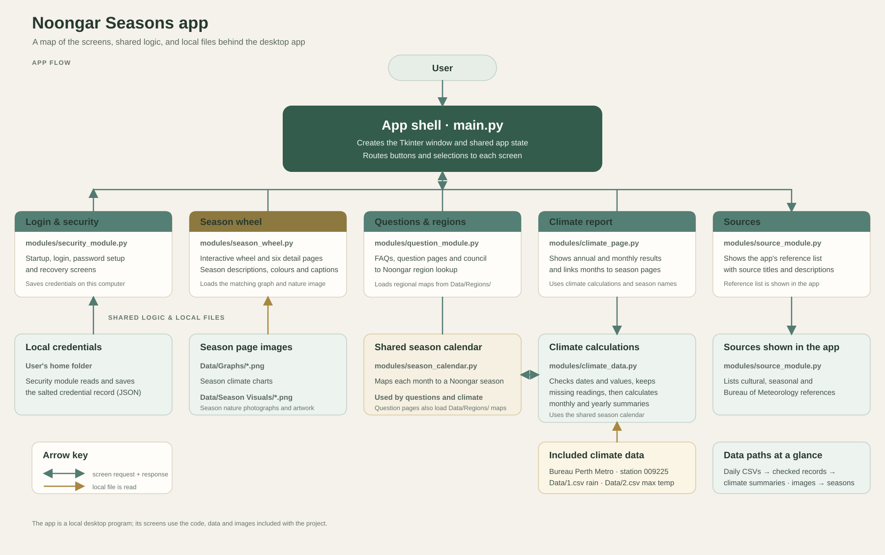

# How the app fits together

## How to read the map

- **The app shell** in `main.py` creates one Tkinter window and routes actions to the feature screens. The two-way arrows show screen calls and callbacks.
- **Questions and the climate screen** use the shared month-to-season mapping. The question screen also loads the regional maps.
- **The season wheel** loads the matching graph and nature image for each season.
- **The climate screen** asks `climate_data.py` to read the included Bureau of Meteorology CSV files and return summaries.
- **Sources** shows the references used by the app. The app's data and images are included as local files.

The automated tests are separate from the running app. `tests/test_main.py` checks app routing.
