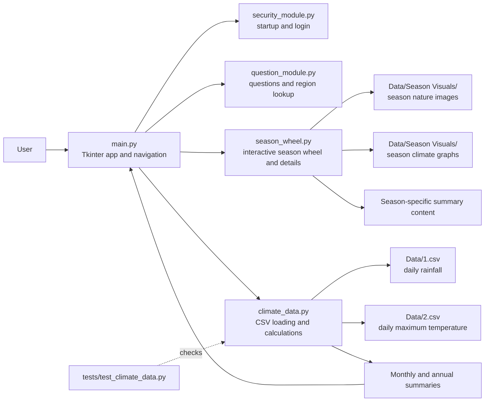

# Application Architecture

## How the pieces work together

- `main.py` creates the Tkinter window, starts the app, and routes navigation between screens.
- `security_module.py` supplies the startup and login screens.
- `question_module.py` provides question-and-answer content and the council-to-region lookup.
- `season_wheel.py` draws the interactive season wheel and builds the season detail pages. It loads image assets from `Data/`.
- `climate_data.py` reads rainfall and maximum-temperature observations from `Data/1.csv` and `Data/2.csv`, validates dates and values, joins readings by date, and calculates summaries for the climate page.
- `tests/test_climate_data.py` checks the climate data reader and its calculations.
